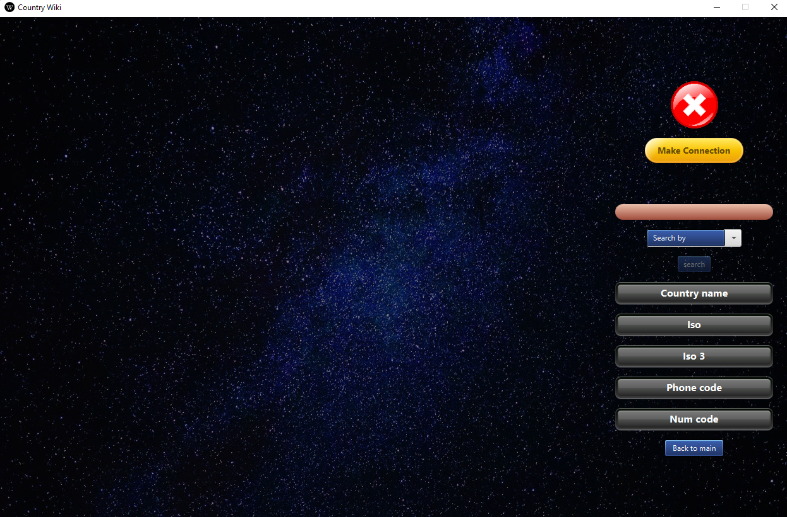

# SimpleProjectsPlatform

Personal program to store simple projects. 
Mainly created for learning new technologies and libraries.

# ***Technologies, libraries and mechanics used for this project***
- java
- awt - listeners
- FXML files
- CSS files
- maven
- basic sql connection
- JavaFX

# Music Player
Gui's program was created using JavaFX and css files.
To load music files to player, you have to put .mp3 files into a resources' dictionary.

*Mechanics*
- changing song speed [25%, 50%, 75%, 100%, 125%, 150%, 175%, 200%]
- volume slider
- playing next/previous/random song
- start/stop/reset song

#Wiki Countries
Gui's of the project was created with JavaFX. It shows basic information about countries
which are stored in database. To use the program, you have to install mysql, create database and execute query from
file `world` in resource's dictionary. After that, you have to put into the program data about of your local base
and connect with it. Program allows searching information from country name, num code and phone code. For example if
you will write 48 and press search button, you will get information about Poland.

